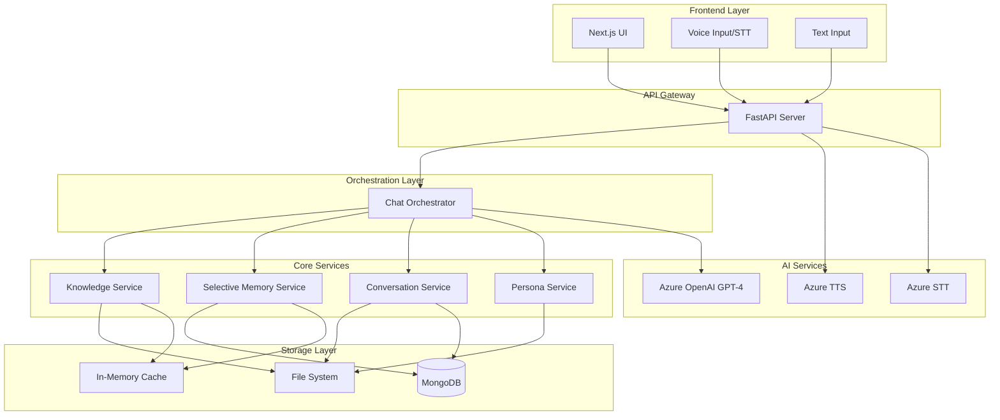
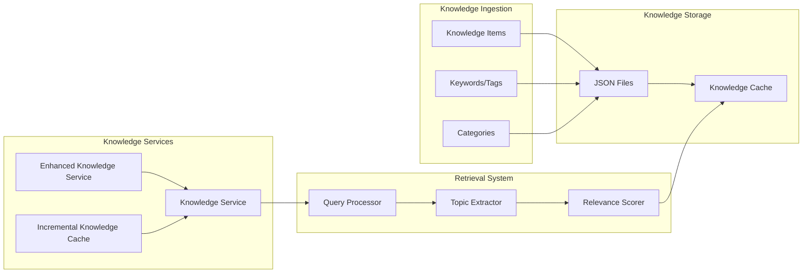
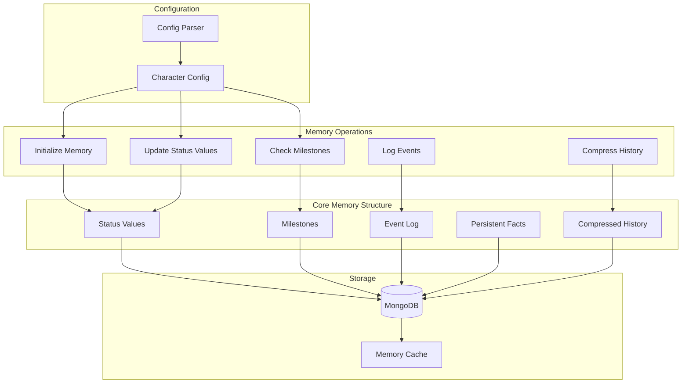
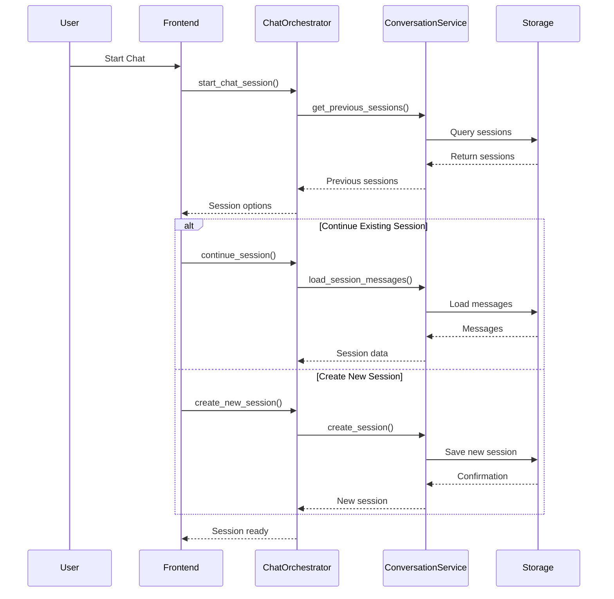
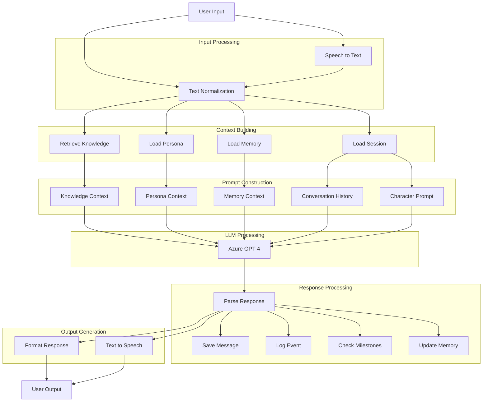
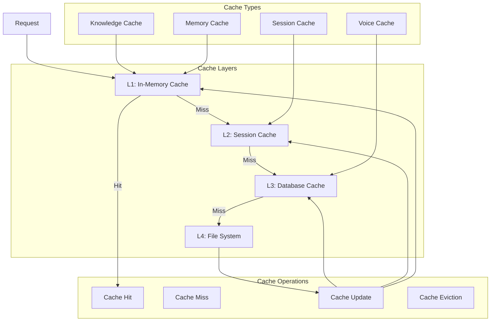

# RAG & Memory System Architecture

## System Overview

This document provides a comprehensive architectural overview of the RAG (Retrieval-Augmented Generation) and Memory management systems in the Voice Character Chat Demo application.

## High-Level Architecture



## RAG System Architecture

### Knowledge Processing Pipeline



### Knowledge Service Components

#### 1. **Base Knowledge Service** (`knowledge_service.py`)
- **File Storage**: `knowledge/characters/{character_id}/knowledge.json`
- **Caching**: In-memory cache loaded on initialization
- **Search Algorithm**:
  - Weighted keyword matching
  - Scoring weights:
    - Trigger keywords: 10 points
    - Title match: 5 points
    - Tag match: 3 points
    - Content match: 1 point
- **CRUD Operations**: Create, Read, Update, Delete knowledge items

#### 2. **Enhanced Knowledge Service** (`enhanced_knowledge_service.py`)
- **Semantic Expansion**: Maps abbreviations to full terms
  - Example: "vars" → ["variables", "variable", "var"]
- **Smart Search**: Expands queries semantically before searching
- **Relevance Scoring**: Enhanced scoring with semantic understanding

#### 3. **Incremental Knowledge Cache** (`incremental_knowledge_cache.py`)
- **Session-based Caching**: Per-session knowledge accumulation
- **Greeting Analysis**: Extracts topics from initial greeting
- **Incremental Addition**: Adds new knowledge as topics emerge
- **Topic Relevance**: 
  - Direct match: 0.8 score
  - Substring match: 0.6 score
  - Related topics: 0.3 score
  - Temporal keywords: 0.2 score

### Knowledge Data Structure

```json
{
  "character_id": "character_001",
  "knowledge_items": [
    {
      "id": "kb_12345678",
      "title": "3·1 Independence Movement",
      "content": "Detailed information about the movement...",
      "keywords": ["3·1 운동", "독립운동", "유관순"],
      "category": "Korean History",
      "trigger_keywords": ["3·1", "independence"],
      "context_keywords": ["1919", "March 1st"],
      "usage_count": 0,
      "created_at": "2025-01-01T10:00:00",
      "updated_at": "2025-01-01T10:00:00"
    }
  ]
}
```

## Memory System Architecture

### Selective Memory Components



### Memory Service Features

#### 1. **Status Values Management**
- Dynamic character-specific metrics
- Boundary checking (min/max values)
- Real-time updates based on interactions
- Examples: affection, trust, stress, curiosity

#### 2. **Milestone System**
- Achievement tracking
- Condition-based triggers:
  - Conversation count thresholds
  - Status value thresholds
  - Event type counts
  - Context conditions
- Rewards system (status updates)

#### 3. **Event Logging**
- Timestamped event tracking
- Event types and descriptions
- Impact on status values
- Limited to last 100 events

#### 4. **Persistent Facts**
- Long-term user information
- Preferences and personal details
- Limited to 50 facts
- Never forgotten across sessions

#### 5. **History Compression**
- Summarizes old conversations
- Preserves important information
- Reduces token usage
- Character-specific compression prompts

### Memory Data Structure (MongoDB)

```json
{
  "_id": "ObjectId",
  "user_id": "user_123",
  "character_id": "character_001",
  "core_memory": {
    "status_values": {
      "affection": 75,
      "trust": 60,
      "stress": 20
    },
    "milestones": [
      {
        "id": "first_meeting",
        "achieved_at": "2025-01-01T10:00:00",
        "description": "First conversation",
        "rewards": {"trust": 10}
      }
    ],
    "event_log": [
      {
        "timestamp": "2025-01-01T10:00:00",
        "event_type": "greeting",
        "description": "User greeted character",
        "impact": {"affection": 5}
      }
    ],
    "persistent_facts": [
      "User is a software developer",
      "Prefers Korean language"
    ],
    "compressed_history": "User discussed Korean history...",
    "conversation_count": 5,
    "last_interaction": "2025-01-01T10:30:00"
  },
  "created_at": "2025-01-01T10:00:00",
  "last_updated": "2025-01-01T10:30:00",
  "version": 1
}
```

## Conversation Management

### Session Flow



### Session Storage

#### File System Structure
```
conversations/
├── {user_id}/
│   └── {character_id}/
│       ├── sess_20250101_120000_abc123.json
│       └── sess_20250101_140000_def456.json
```

#### Session Data Structure
```json
{
  "session_id": "sess_20250101_120000_abc123",
  "user_id": "user_123",
  "character_id": "character_001",
  "persona_id": "persona_001",
  "created_at": "2025-01-01T12:00:00",
  "last_updated": "2025-01-01T12:30:00",
  "status": "active",
  "messages": [
    {
      "id": "msg_001",
      "role": "user",
      "content": "Hello",
      "timestamp": "2025-01-01T12:00:00"
    },
    {
      "id": "msg_002",
      "role": "assistant",
      "content": "Hi there!",
      "timestamp": "2025-01-01T12:00:05",
      "knowledge_used": ["kb_12345678"],
      "status_updates": {"affection": 5}
    }
  ],
  "message_count": 2,
  "session_summary": "Greeting conversation",
  "session_tags": ["greeting", "introduction"]
}
```

## Message Processing Pipeline



## Caching Strategy

### Multi-Level Cache Architecture



### Cache Implementation Details

#### 1. **Knowledge Cache**
- **Location**: In-memory (service initialization)
- **Scope**: Per character
- **TTL**: Application lifetime
- **Size Limit**: All knowledge items loaded

#### 2. **Memory Cache**
- **Location**: In-memory dictionary
- **Scope**: Per user-character pair
- **Key**: `{user_id}_{character_id}`
- **TTL**: Session lifetime
- **Size Limit**: Active sessions only

#### 3. **Session Cache**
- **Location**: IncrementalKnowledgeCache
- **Scope**: Per session
- **Key**: `session_id`
- **TTL**: Session lifetime
- **Features**:
  - Topic-based organization
  - Chronological tracking
  - Incremental addition

#### 4. **Voice Cache**
- **Location**: File system
- **Scope**: Global
- **Key**: Hash of text + voice_id
- **TTL**: Configurable (default: 24 hours)
- **Size Limit**: Disk space based

## Performance Optimizations

### 1. **Greeting-Triggered Caching**
- Pre-loads relevant knowledge from greeting analysis
- Reduces search latency for initial topics
- Improves response time for first interactions

### 2. **Incremental Knowledge Addition**
- Only retrieves knowledge for new topics
- Reuses cached knowledge for known topics
- Reduces redundant database queries

### 3. **Weighted Relevance Scoring**
- Fast keyword-based matching
- Hierarchical scoring system
- Early termination for low-relevance items

### 4. **History Compression**
- Reduces token usage in prompts
- Preserves important information
- Periodic compression (configurable)

### 5. **Parallel Processing**
- Concurrent knowledge retrieval
- Async database operations
- Non-blocking cache updates

## Data Flow Summary

### Complete Message Flow

1. **Input Reception**
   - Voice → STT → Text
   - Direct text input

2. **Context Preparation**
   - Load/create session
   - Retrieve relevant knowledge (RAG)
   - Load selective memory
   - Get persona context

3. **Prompt Construction**
   - Character prompt (XML structure)
   - Memory injection
   - Knowledge injection
   - Conversation history
   - Persona attributes

4. **LLM Processing**
   - Azure OpenAI GPT-4
   - Response generation

5. **Post-Processing**
   - Update status values
   - Check milestones
   - Log events
   - Add persistent facts
   - Compress history (if needed)

6. **Response Delivery**
   - TTS generation
   - Response formatting
   - Cache updates
   - Session save

## MongoDB Collections

### Primary Collections

1. **characters**
   - Character definitions
   - Prompts and configurations
   - Voice settings

2. **selective_memories**
   - Core memory objects
   - Status values
   - Milestones and events

3. **knowledge_base**
   - Character knowledge items
   - Categories and keywords
   - Usage statistics

4. **conversations** (optional)
   - Session data
   - Message history
   - Session metadata

5. **personas**
   - User personas
   - Attributes and preferences

## API Endpoints

### Knowledge Management
- `GET /knowledge/{character_id}` - Retrieve knowledge
- `POST /knowledge/{character_id}` - Add knowledge
- `PUT /knowledge/{character_id}/{item_id}` - Update
- `DELETE /knowledge/{character_id}/{item_id}` - Delete

### Memory Management
- `GET /memory/{user_id}/{character_id}` - Get memory
- `POST /memory/initialize` - Initialize memory
- `PUT /memory/update` - Update status values
- `POST /memory/compress` - Compress history

### Session Management
- `POST /chat/session/start` - Start session
- `POST /chat/session/continue/{session_id}` - Continue
- `POST /chat/message` - Send message

## Future Enhancements

### Planned Improvements

1. **Vector Database Integration**
   - Semantic search capabilities
   - Embeddings for knowledge items
   - Similarity-based retrieval

2. **Advanced Caching**
   - Redis integration
   - Distributed caching
   - Cache warming strategies

3. **Real-time Updates**
   - WebSocket connections
   - Live memory updates
   - Streaming responses

4. **Enhanced Compression**
   - LLM-based summarization
   - Context-aware compression
   - Multi-level compression

5. **Analytics & Monitoring**
   - Knowledge usage tracking
   - Memory update patterns
   - Performance metrics

---

*This architecture document provides a comprehensive overview of the RAG and Memory systems. For implementation details, refer to the individual service files in the codebase.*